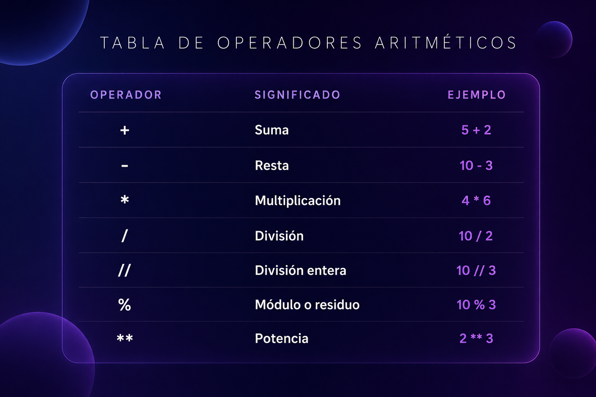
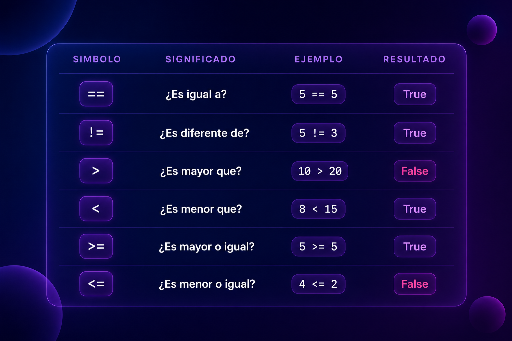

# 1. Operadores Aritméticos
Se usan para realizar cálculos matemáticos. El resultado siempre es un número.


# 2. Operadores Relacionales (Comparación)
Se usan para comparar valores. El resultado siempre es `True` o `False`.


# 3. Operadores Lógicos
Se usan para combinar condiciones. El resultado siempre es `True` o `False`.
`and` (Y): Devuelve `True` solo si ambas condiciones son verdaderas.Ejemplo: `(5 > 3) and (10 < 20) ---> True`
`or` (O): Devuelve `True` si al menos una de las condiciones es verdadera.Ejemplo: `(5 > 3) or (10 < 5) ---> True`
`not` (NO): Invierte el valor de la condición.Ejemplo: `not (5 > 3) ---> False`

## 4. Jerarquía de Operaciones (Orden de prioridad)
Cuando Python encuentra una línea con muchos operadores, los resuelve en este estricto orden:

1. Paréntesis `()`
2. Exponentes `**`
3. Multiplicación `*`, División `/`, División entera `//`, Módulo `%`
4. Suma `+` y Resta `-`
5. Operadores Relacionales (`==`, `!=`, `<`, `>`, `<=`, `>=`)
6. Operadores Lógicos (`not`, `and`, `or`)

Un código nemotécnico en español para recordar esto es:
**P**ara **E**vitar **M**alentendidos, **S**iempre **R**esuelve **O**peraciones **L**ógicas.

# Ejercicios de Python: Operadores y Expresiones

## 1. Operadores Aritméticos

El objetivo es dominar los números y los símbolos especiales (`//`, `%`, `**`).

### El Reparto
Tienes 45 manzanas y quieres darle 7 a cada uno de tus amigos.  
¿Cuántas manzanas te sobran?  
Usa el operador de módulo (`%`).

### El Cubo
Calcula cuánto es `5 ** 3` usando el operador de potencia.

### Billetera Vacía
Si tienes $100 y compras 3 hamburguesas de $22 cada una, ¿cuánto dinero te queda?

### Cajas Completas
Tienes 130 libros y en cada caja caben 12.  
¿Cuántas cajas completamente llenas tendrás?  
Usa división entera (`//`).

### Promedio Rápido
Calcula el promedio de estas tres notas: 80, 95 y 100.  
Recuerda usar paréntesis.

---

## 2. Operadores Relacionales

Aquí la respuesta siempre debe ser `True` o `False`.

### ¿Es Par?
Escribe una comparación que verifique si el residuo de la expresión `numero % 2` es igual a `0`. Siendo `numero` una variable que puedes cambiar.

### Cupo Lleno
Tienes una variable:

```python
invitados = 50
```

Escribe una comparación para saber si los invitados son menores o iguales a 60.

### Contraseña
Tienes:

```python
clave_real = "Python123"
intento = "python123"
```

Compara si son exactamente iguales.  
Observa cuidadosamente las mayúsculas y minúsculas.

### Diferencia
Verifica si el resultado de `10 / 2` es diferente de `5`.

### Edad Legal
Crea una variable `edad`.  
Escribe la comparación para saber si esa edad es mayor o igual a 18.

---

## 3. Operadores Lógicos (`and`, `or`, `not`)

Combinando condiciones de la vida real.

### Examen y Asistencia
Un alumno aprueba si su nota es mayor a 70 **y** su asistencia es mayor al 80%.

### Día de Descanso
Es día de descanso si es sábado **o** si es domingo.

### Sensor de Luz
Una lámpara se enciende si hay movimiento **y no** es de día.

### Bono de Regalo
Un cliente recibe un regalo si su compra es mayor a $500 **o** si es su primer pedido (`True`).

### Validación Inversa
Tienes la variable:

```python
usuario_baneado = True
```

Escribe una expresión usando `not` que devuelva `True` solo si el usuario no está baneado.

---

## 4. Evaluación de Expresiones (Mezcla de Todo)

Resuelve paso a paso en papel o en la consola.

### Nivel Básico

```python
resultado = 10 + 5 * 2 ** 2
```

¿Qué operación se realiza primero?

### Nivel Lógico

```python
resultado = (5 > 3) and (10 < 5 or 7 == 7)
```

### Nivel "Sistemas"

```python
acceso = (usuario == "admin") or (intentos < 3 and not bloqueado)
```

Prueba con:

```python
usuario = "user"
intentos = 2
bloqueado = False
```

### Nivel Matemático

```python
valor = 20 // 3 + 10 % 3
```
Resuelve mentalmente o en papel antes de usar la consola.
### El Mega Reto

```python
final = (100 / 2 > 40) and (10 * 2 == 20) and not (5 + 5 <= 9)
```

---

## 5. Casos de "Lógica de Negocio"

Situaciones reales para pensar como programador.

Escribe el código que resuelva cada caso usando operadores lógicos y relacionales.

### Cajero Automático
Puedes sacar dinero si:

- `monto_a_retirar` es menor o igual al `saldo_cuenta`
- y el monto es múltiplo de 10

Pista:

```python
monto_a_retirar % 10 == 0
```

### Streaming
Una película es apta si:

- `edad_usuario` es mayor a 13
- o si tiene `permiso_parental` (`True`)

### Tienda Online
El envío es gratis si:

- la compra es mayor a $100
- y el destino es `"Local"`

### Videojuego
El jugador pierde una vida si:

- toca lava
- o cae al vacío

Pero no pierde vida si tiene el `escudo_activo`.

### Login Seguro
El botón de "Entrar" se activa solo si:

- el usuario no está vacío
- y la contraseña tiene más de 8 caracteres

Pista:

```python
len(password) > 8
```
